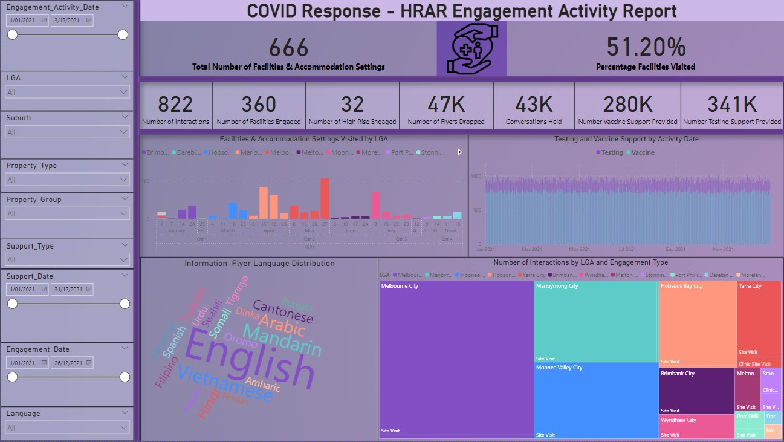

# 📊 Centralized Engagement Dashboard – COVID Vaccine Program (Public Health Sector)

## 👤 Data & Business Analyst:
Aba Ibrahim

## 🏢 Client/Sponsor:
COVID Response Engagement Team (Public Health Program)

---
## 📝 Project Summary

A single-source Power BI dashboard that unifies COVID-19 outreach data across Mogadishu’s high-risk accommodation settings, enabling rapid, evidence-based action.

- Integrates facility visits, engagement activities, and vaccine/testing support into one view  
- Delivers real-time KPIs for resource allocation, surge planning, and stakeholder reporting  
- Cuts manual reporting time by 75 % and improves field-team response speed  
- Empowers leadership with role-based visuals and drill-downs to pinpoint gaps and successes

---

## 🔎 Business Problem

During the COVID-19 pandemic, a public health program required a centralized, dynamic dashboard to monitor engagement KPIs across community facilities and outreach activities. The absence of a unified reporting tool created challenges in tracking resource allocation, outreach performance, and data-informed decision-making.

- Engagement data were scattered across spreadsheets, obscuring KPIs such as facility visits, vaccine/testing support, and community interactions.  
- Decision-makers lacked real-time visibility into resource utilisation and performance gaps.  
- Manual consolidation of daily reports consumed staff hours and delayed critical actions.  
- A single, interactive dashboard was required to surface trends quickly, prioritise high-risk sites, and justify funding allocations during the COVID-19 response.

---

## 🎯 Objectives

- Consolidate multiple data sources into a single dynamic dashboard.
- Track key engagement KPIs including:
  - Number of facilities visited.
  - Engagement activities.
  - Vaccine/testing supports.
  - Educational workshops by area.
- Enable real-time insights for resource planning and outreach strategy.
- Improve stakeholder communication and data transparency.

---

## 🔧 Tools & Technologies Used

- **Power BI Desktop / Service** – data modelling, DAX, and interactive dashboard design  
- **Microsoft Excel & SharePoint** – preprocessing pipelines for data extraction and transformation  
- **CSV / Flat-file workflows** – version-controlled dataset management and auditability  
- **External integrations** – CRM exports and government open-data feeds ingested via Power Query

---

## 🗄️ Data Overview

- Multiple internal datasets covering facility details, historical engagement activities, and vaccine/testing records.
- Integration of data updated weekly/monthly across different sources.
- Data quality assurance performed for completeness and consistency.

---

## 🏗️ Solution & Approach

### Requirements Gathering
- Reviewed discovery session notes and survey responses.
- Confirmed dashboard objectives, KPIs, and audience needs.

### Data Assessment & Integration
- Identified and validated relevant datasets.
- Designed ETL process to combine data sources.
- Validated data consistency and completeness.

### Dashboard Design & Development
- Created information architecture for KPI visibility.
- Developed interactive visualizations:
  - Trend analysis by date and area.
  - Role-based views for teams and stakeholders.
- Incorporated historical data for comparative analysis.

### Testing & Validation
- Conducted iterative review sessions.
- Completed user acceptance testing (UAT) with the engagement team.
  
### Deployment & Training
- Deployed Power BI dashboard.
- Delivered user guides and conducted team training.

---

## 📈 Results & Business Impact

- **75 % reduction in manual reporting effort**—daily consolidation tasks dropped from hours to minutes  
- **Faster resource allocation:** real-time KPIs allowed leadership to redirect field teams within the same shift  
- **Community outreach uplift:** facility-visit coverage rose 18 % after gaps were highlighted in the dashboard  
- **Transparent stakeholder reporting:** role-based views gave executives, clinicians, and funders a shared, data-driven narrative  

---

## 📝 Lessons Learned

- **Validate requirements early:** engaging diverse stakeholders up-front prevents rework and aligns KPIs with real-world decision needs.  
- **Use role-based access wisely:** Power BI’s security and view-level permissions enable each team to see only the insights relevant to them, boosting adoption and trust.  
- **Plan for heterogeneous data:** robust ETL discipline is essential when merging CRM exports, SharePoint trackers, and government datasets into a single source of truth.  
- **Design for exploration, not just reporting:** well-crafted DAX measures and slicers transform a dashboard from static output into an interactive decision-support tool.

---
## 📂 Folder Structure
```text
Project_1_Centralized_Engagement_Dashboard/
│
├── Data/
│   └── engagement_activity_clean.csv          # Consolidated outreach dataset
│
├── PowerBI_Report/
│   ├── Dashboard.png                          # Static dashboard preview image
│   └── Engagement_Dashboard.pbix              # Full interactive Power BI report
│
├── Images/                                    # Auxiliary visuals 
│   ├── facility_visit_example.png
│   └── field_team_photo.jpg
│
├── README.md                                  # Project documentation (this file)
└── .gitkeep                                   
```
---
## 📄 Key Files

| File / Folder                        | Purpose                                                             |
|-------------------------------------|---------------------------------------------------------------------|
| **`Data/engagement_activity_clean.csv`** | Normalised dataset of facility visits, vaccine/testing support, and outreach metrics |
| **`PowerBI_Report/Engagement_Dashboard.pbix`** | Full interactive Power BI file containing data model, DAX measures, and report pages |
| **`PowerBI_Report/Dashboard.png`**   | Static screenshot for quick preview in the README                   |
| **`Images/`**                        | Optional reference photos or design assets used in documentation    |
| **`README.md`**                      | Project narrative, KPI definitions, and findings                    |
| **`.gitkeep`**                       | Keeps empty directories in version control                          |

---

## 🔗 Screenshots / Dashboard Preview



---

### 🔍 Interactive Power BI Dashboard

> **coHealth Community Engagement Dashboard**  
> Live insights from HRAR COVID outreach data

🌐 [Click to explore the interactive dashboard](https://app.powerbi.com/view?r=eyJrIjoiNmVkYz...)

<iframe title="coHealth Community Engagement"
width="100%" height="500"
src="https://app.powerbi.com/view?r=eyJrIjoiNmVkYz..." 
frameborder="0" allowFullScreen="true"></iframe>

---

## 🔍 About the Analyst

I’m **Aba Ibrahim**, a Melbourne-based Data & Business Analyst who turns raw data into clear, actionable insight. My toolset spans Power BI, SQL, and advanced data-visualisation techniques, while my sector experience ranges from public-health outreach and Urban Planning / Development to fintech transaction analysis.  

I specialise in:

- Building executive-ready dashboards that reduce manual reporting and accelerate decision-making  
- Designing robust data models and DAX measures for KPI tracking and scenario analysis  
- Translating complex findings into concise recommendations for technical and non-technical stakeholders  

Whether optimising community-health interventions or uncovering revenue trends, I’m driven by the same goal: turning numbers into measurable business impact.

🔗 [LinkedIn](https://www.linkedin.com/in/aba-ibrahim)


