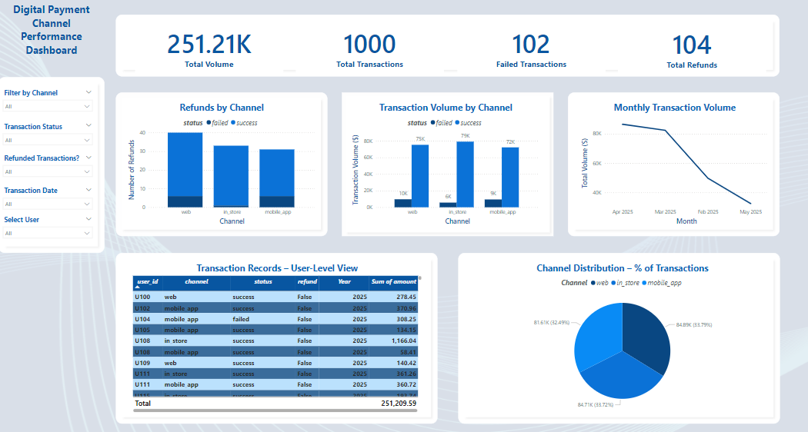

# 📊 Financial Transactions Dashboard – Business Insights (Retail/Fintech Sector)

## 👤 Data Analyst:
Aba Ibrahim

## 🏢 Client/Sponsor:
Internal Executive Team – Transaction Monitoring Unit

---

## 🔎 Business Problem

The client needs a dynamic dashboard to analyze financial transaction data across business units. The existing static reports make it difficult to identify anomalies, track performance trends, and optimize decision-making. A centralized, interactive Power BI dashboard is required to drive real-time insights into customer behavior, revenue trends, and operational risks.

---

## 🎯 Objectives

- Clean, transform, and model transaction data for dashboard reporting.
- Track key performance indicators (KPIs) including:
  - Transaction volume by type and channel
  - Average transaction value by customer segment
  - Daily/weekly revenue flow
  - Anomalies and irregular patterns
- Enable cross-filtering by region, customer type, and time period.
- Improve transparency for leadership to take timely strategic action.

---

## 📁 Folder Structure

---

## 📷 Dashboard Preview

---

## 📘 Lessons Learned

- Importance of data granularity when visualizing financial insights.
- Role of Power BI’s DAX measures for flexible aggregation and slicing.
- Designing KPIs that align with strategic business questions.

---

## 📄 Files

| File                       | Description                                                    |
|----------------------------|----------------------------------------------------------------|
| Dashboard.pbix / .jpg      | Power BI dashboard (or sanitized screenshot)                   |
| transactions_raw.csv       | Sample or sanitized transactional dataset                      |
| README.md                  | This project documentation                                     |

---

## 🔍 About the Analyst

Aba Ibrahim is a data analyst passionate about delivering insight-driven dashboards that solve real-world business problems. With expertise in Power BI, SQL, and data storytelling, he specializes in turning messy data into compelling narratives.

