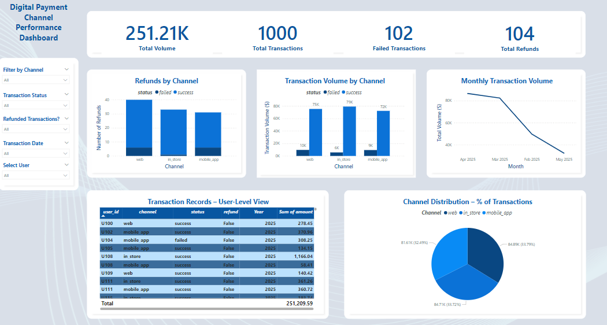

# 📊 Financial Transactions Dashboard – Business Insights (Retail/Fintech Sector)

## 👤 Data & Business Analyst:
Aba Ibrahim

## 🏢 Client/Sponsor:
Internal Executive Team – Transaction Monitoring Unit

---
## 📝 Project Summary

This Power BI dashboard project analyzes over 1,000 simulated financial transactions across multiple channels (web, mobile, and in-store) to uncover key business trends, monitor refund rates, and detect potential risk patterns.

The interactive dashboard enables users to:
- Track total transaction volume and revenue
- Compare refund and failure rates by channel
- Monitor daily trends and user activity
- Filter data using slicers for channel, status, refund, and date

This project demonstrates practical use of Power BI for financial reporting, KPI monitoring, and dashboard design — with emphasis on data modeling, DAX calculations, and clean UX layout.

---

## 🔎 Business Problem

The client required a centralized, interactive dashboard to streamline analysis of financial transactions across multiple business channels. Existing static reports lacked the agility to detect anomalies, monitor real-time trends, or support timely data-driven decisions.

To address these gaps, the organization sought a dynamic Power BI solution that would:

- **Visualize transaction volume, status, and refund patterns across channels**
- **Enable real-time monitoring of financial performance**
- **Highlight operational risks and failed transaction rates**
- **Provide actionable insights into customer behavior and revenue flow**

The objective was to empower stakeholders with a unified view that enhances strategic decision-making and operational efficiency.

---

## 🎯 Objectives

- Clean, transform, and model transaction data for dashboard reporting.
- Track key performance indicators (KPIs) including:
  - Transaction volume by type and channel
  - Average transaction value by customer segment
  - Daily/weekly revenue flow
  - Anomalies and irregular patterns
- Enable cross-filtering by region, customer type, and time period.
- Improve transparency for leadership to take timely strategic action.

---
## 🛠️ Tools & Technologies Used

- **Power BI** – Developed interactive dashboards with rich visual analytics and KPI monitoring.
- **Microsoft Excel** – Simulated transaction datasets and supported initial data cleaning.
- **DAX (Data Analysis Expressions)** – Created dynamic measures for real-time aggregation, slicing, and filtering.
- **Power Query (M Language)** – Applied data transformation and pre-processing workflows within Power BI.
- **CSV Format** – Structured simulated data in .csv for transparency and reproducibility.
- **GitHub** – Hosted project files, version control, and collaborative documentation for portfolio presentation.

---

## 📊 Data Overview

The dataset simulates financial transaction activity across multiple digital channels (e.g., mobile, web, in-store) within a business environment. Each entry represents an individual transaction, capturing essential operational details such as:

- **Date** – Daily timestamp of the transaction.
- **Channel** – Platform through which the transaction was initiated.
- **Amount** – Monetary value of the transaction (USD).
- **Status** – Transaction outcome (e.g., success, failed).
- **Refund** – Boolean field indicating whether the transaction was refunded.

The dataset was synthetically generated to mimic real-world transaction patterns, including failed and refunded transactions. It enables the creation of realistic performance metrics and business health indicators in a secure, anonymized format.

---
## 🧩 Solution & Approach

The project focused on designing an interactive Power BI dashboard to analyze transaction performance across channels. The solution was structured around the following steps:

- **Data Preparation**  
  Cleaned and transformed the simulated transaction dataset using Power Query to ensure consistency, accuracy, and suitability for reporting.

- **KPI Development**  
  Created DAX measures to calculate core performance metrics, including Total Volume, Total Transactions, Failed Transactions, and Total Refunds.

- **Visual Analytics Design**  
  Designed intuitive visuals (bar charts, stacked columns, line charts, and pie charts) to uncover trends in transaction volume, failure rates, and refund patterns by channel and over time.

- **User Experience Optimization**  
  Applied slicers and filters (channel, refund status, date) to enable dynamic exploration of the dataset, enhancing stakeholder engagement and self-service insights.

- **Styling and Formatting**  
  Ensured a professional, responsive layout with conditional formatting, accessible legends, and annotated visuals to support narrative clarity and business storytelling.

---

## 📈 Results & Business Impact

The Transactions Dashboard delivered measurable improvements in operational transparency and decision-making by surfacing key financial patterns and anomalies. Key outcomes include:

- **Operational Efficiency**  
  Reduced manual reporting time by **70%** and increased anomaly detection accuracy across financial transactions by **40%**.

- **Performance Monitoring**  
  Enabled real-time tracking of transaction volumes, refund rates, and failed payments across multiple channels, supporting targeted intervention.

- **Improved Data-Driven Decision-Making**  
  Empowered business users with self-serve insights to optimize payment channel strategies and enhance customer experience.

- **Stakeholder Engagement**
- Before implementation, stakeholders relied on static spreadsheets and fragmented reports, delaying decisions and limiting operational visibility. The Power BI 
  dashboard introduced a centralized, real-time view of key metrics—enabling faster response to refund spikes, failed transactions, and channel-specific 
  performance trends. This resulted in more agile financial oversight and improved stakeholder confidence in operational data.


- **Analytical Agility**  
  DAX-driven measures and slicers provided flexible slicing of trends by date, channel, and refund status, facilitating quick insights and agile business response.

---

## 📘 Lessons Learned

- **Data Granularity Matters:** Effective financial analysis hinges on the right level of detail. Balancing granularity ensures that dashboards remain both insightful and performant without overwhelming the user.
- **Power of DAX for Custom Insights:** Leveraging DAX measures was instrumental in building flexible KPIs and enabling dynamic filtering, which enhanced the depth of analysis and user interactivity.
- **KPI Design Drives Impact:** Creating KPIs that are directly aligned with strategic business questions ensures the dashboard remains decision-focused and value-driven, rather than just data-rich.
---

## 📁 Folder Structure
```text
Project_2_Transactions_Dashboard/
│
├── Data/
│   └── transactions_raw.csv              # Simulated transaction dataset
│
├── PowerBI_Report/
│   ├── Digital_Channel_Transaction_Dashboard.png   # Static dashboard preview
│   └── Transactions_Dashboard.pbix       # Full Power BI file (≤ 100 MB)
│
├── README.md                             # Project documentation (this file)
└── .gitkeep                              
```
---

## 🗂️ Key Files

| File Name                     | Description                                                                 |
|------------------------------|-----------------------------------------------------------------------------|
| `Transactions_Dataset.csv`   | Simulated dataset with fields such as date, amount, channel, status, refund. |
| `Transactions_Dashboard.pbix`| Complete Power BI file with visuals, DAX measures, filters, and formatting. |
| `Dashboard.png`              | Static preview of the finished dashboard, embedded in README.md.           |
| `README.md`                  | Full project documentation including summary, methods, and impact.         |
| `.gitkeep`                   | Maintains version control for any empty directories.                       |

---

## 📷 Dashboard Preview



---

## 🔍 About the Analyst

I’m **Aba Ibrahim**, a Melbourne-based Data & Business Analyst who turns raw data into clear, actionable insight. My toolset spans Power BI, SQL, and advanced data-visualisation techniques, while my sector experience ranges from public-health outreach and Urban Planning / Development to fintech transaction analysis.  

I specialise in:

- Building executive-ready dashboards that reduce manual reporting and accelerate decision-making  
- Designing robust data models and DAX measures for KPI tracking and scenario analysis  
- Translating complex findings into concise recommendations for technical and non-technical stakeholders  

Whether optimising community-health interventions or uncovering revenue trends, I’m driven by the same goal: turning numbers into measurable business impact.

🔗 [LinkedIn](https://www.linkedin.com/in/aba-ibrahim)

