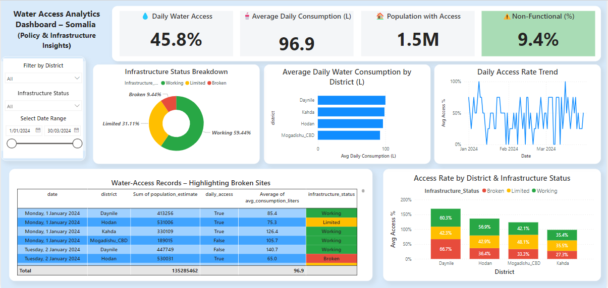

# 💧 Water Access Analytics Dashboard – Somalia (Policy & Infrastructure Insights)

## 👨🏽‍💻 Chemical Engineer & Data Analyst:
Aba Ibrahim

## 🏛️ Client/Sponsor:
Federal Somalia Government – Urban Development & Water Authority. 

---

## 📌 Project Summary

This project delivers an interactive Power BI dashboard that highlights water-access equity and infrastructure gaps across Mogadishu’s CBD and the high-growth districts of Daynile, Hodan, and Kahda. By digitising daily access metrics and infrastructure-status data, the solution simulates real-world planning challenges and transforms them into actionable insights.

The dashboard equips policymakers and NGO partners with:

- Clear visibility of household-level access rates and consumption trends  
- District-by-district comparisons of working, limited, and broken water assets  
- Data-driven evidence to prioritise capital spending, target maintenance, and improve equitable service delivery in resource-constrained environments

---

## 🚨 Problem Statement
Access to clean, affordable, and equitable water services remains a significant challenge across Somali cities. While population growth accelerates in urban and peri-urban settlements, planning efforts are often hindered by a lack of centralized and accessible water access data.

Current limitations include:
- Fragmented infrastructure records
- Inconsistent population-to-access ratios
- Lack of real-time visual insights for stakeholders

---

## 🎯 Objectives
- Simulate water access data for high-growth urban districts
- Create a centralized analytics dashboard to explore coverage rates, equity gaps, and infrastructure needs
- Showcase how Power BI can help urban planners, government units, and NGOs make data-informed decisions
- Embed interactive visuals to illustrate disparities and prioritize future investments

---

## 📂 Folder Structure
```text
Project_3_WaterAccess_Somalia/
│
├── Data/
│   └── Water_Access_Somalia_Updated.csv
│
├── PowerBI_Report/
│   ├── Dashboard.png                   # Static preview image
│   └── WaterAccess_Somalia.pbix        # Full Power BI file (≤ 100 MB or via Git LFS)
│
├── Images/                             # Field or reference photos
│   ├── Ground_Well_water_sample_collection_Daynile.png
│   ├── Water_Tanks_Hodan.png
│   └── Water_meters_Mogadishu.png
│
├── README.md                           # Project documentation (this file)
└── .gitkeep                            # Keeps empty dirs in version control
```     

---

## 📂 Files

| File                        | Description                                         |
|----------------------------|-----------------------------------------------------|
| `Water_Access_Somalia.csv` | Simulated dataset of water access records by region |
| `Dashboard.png`            | Visual screenshot of the Power BI report            |
| `README.md`                | Project overview and documentation                  |

---

## 🛠 Tools & Technologies Used

- **Power BI** – dashboard design, storytelling
- **Excel/CSV** – simulated dataset management
- **Markdown** – project documentation
- **GitHub** – portfolio showcase

---

## 🖼️ Dashboard Preview



---

## 📘 Lessons Learned

- **Data quality is foundational:** Clean, context-rich datasets are indispensable for any meaningful infrastructure analysis.  
- **Visual storytelling drives action:** Clear, interactive narratives translate complex water-access data into policy-ready insights.  
- **Local simulation builds empathy:** Replicating on-the-ground infrastructure challenges helps stakeholders understand urgency and prioritize resources.  
- **DAX and dynamic filtering matter:** Well-crafted measures and slicers elevate the dashboard from static reporting to an exploratory decision-support tool.


---

